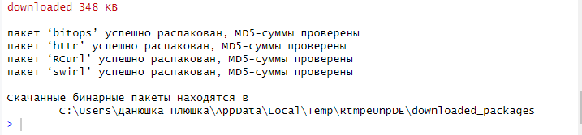
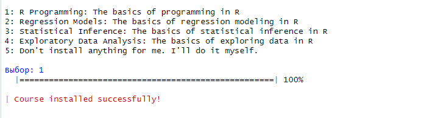
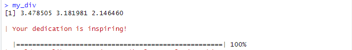
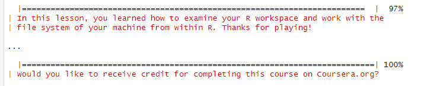
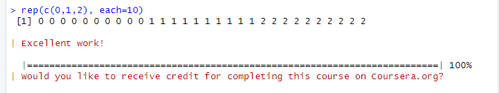
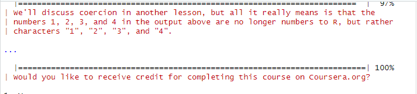
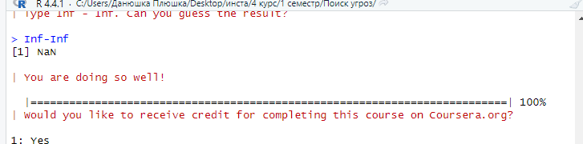

# Введение в R
KDA

## Цель

1.  Развить практические навыки использования языка программирования R
    для обработки данных
2.  Развить навыки работы в Rstudio IDE:
    -   установка пакетов
    -   работа с проектами в Rstudio
    -   настройка и работа с Git
3.  Закрепить знания базовых типов данных языка R и простейших операций
    с ними

## ️Исходные данные

1.  R 4.4.1
2.  RStudio 2024.04.2+764

## ️Общий план выполнения

Освоение базовых операций в языке R с использованием программного пакета
**swirl**.

## Содержание ЛР

### Шаг 1: Настройка swirl

1.  **Установить программный пакет swirl с помощью:**

    -   интерфейса RStudio IDE

    

2.  **Запустить задание с помощью** **swirl::swirl()**

``` r
swirl::info()
```


    | When you are at the R prompt (>):

    | -- Typing skip() allows you to skip the current question.

    | -- Typing play() lets you experiment with R on your own; swirl will ignore
    | what you do...

    | -- UNTIL you type nxt() which will regain swirl's attention.

    | -- Typing bye() causes swirl to exit. Your progress will be saved.

    | -- Typing main() returns you to swirl's main menu.

    | -- Typing info() displays these options again.

1.  **Выбрать из меню курсов
    `1. R Programming: The basics of programming in R`**

    

### Шаг 2: Прохождение подкурсов

1 **базовые структурные блоки**



2 **рабочие пространства и файлы**

 3 **последовательности чисел**



4 **векторы** 

5 **пропущенные значения**

 \## ️Оценка результата

Освоены базовые операции языка R

## ️Вывод

1.  Установлен пакет swirl
2.  Выполнено 5 подкурсов
3.  Составлен отчет
