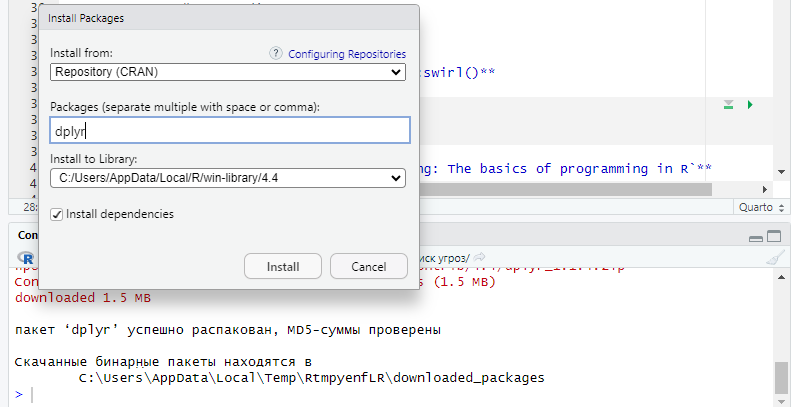

# Основы обработки данных с помощью R и Dplyr
KDA

## Цель

1.  Развить практические навыки использования языка программирования R
    для обработки данных
2.  Закрепить знания базовых типов данных языка R
3.  Развить практические навыки использования функций обработки данных
    пакета `dplyr` – функции
    `select(), filter(), mutate(), arrange(), group_by()`

## ️Исходные данные

1.  R 4.4.1
2.  RStudio 2024.04.2+764

## ️Общий план выполнения

Используя R и среду разработки RStudio IDE, выполнить задания.

## Содержание ЛР

### Шаг 1: Настройка swirl

1.  **Установить программный пакет dplyr с помощью:**

    -   интерфейса RStudio IDE

        

2.  **Проверить наличие данных**

``` r
library(dplyr)
```

    Warning: пакет 'dplyr' был собран под R версии 4.4.2


    Присоединяю пакет: 'dplyr'

    Следующие объекты скрыты от 'package:stats':

        filter, lag

    Следующие объекты скрыты от 'package:base':

        intersect, setdiff, setequal, union

``` r
knitr::kable(head(starwars))
```

<table style="width:100%;">
<colgroup>
<col style="width: 4%" />
<col style="width: 1%" />
<col style="width: 1%" />
<col style="width: 3%" />
<col style="width: 3%" />
<col style="width: 2%" />
<col style="width: 3%" />
<col style="width: 1%" />
<col style="width: 2%" />
<col style="width: 2%" />
<col style="width: 2%" />
<col style="width: 47%" />
<col style="width: 12%" />
<col style="width: 9%" />
</colgroup>
<thead>
<tr class="header">
<th style="text-align: left;">name</th>
<th style="text-align: right;">height</th>
<th style="text-align: right;">mass</th>
<th style="text-align: left;">hair_color</th>
<th style="text-align: left;">skin_color</th>
<th style="text-align: left;">eye_color</th>
<th style="text-align: right;">birth_year</th>
<th style="text-align: left;">sex</th>
<th style="text-align: left;">gender</th>
<th style="text-align: left;">homeworld</th>
<th style="text-align: left;">species</th>
<th style="text-align: left;">films</th>
<th style="text-align: left;">vehicles</th>
<th style="text-align: left;">starships</th>
</tr>
</thead>
<tbody>
<tr class="odd">
<td style="text-align: left;">Luke Skywalker</td>
<td style="text-align: right;">172</td>
<td style="text-align: right;">77</td>
<td style="text-align: left;">blond</td>
<td style="text-align: left;">fair</td>
<td style="text-align: left;">blue</td>
<td style="text-align: right;">19.0</td>
<td style="text-align: left;">male</td>
<td style="text-align: left;">masculine</td>
<td style="text-align: left;">Tatooine</td>
<td style="text-align: left;">Human</td>
<td style="text-align: left;">A New Hope , The Empire Strikes Back,
Return of the Jedi , Revenge of the Sith , The Force Awakens</td>
<td style="text-align: left;">Snowspeeder , Imperial Speeder Bike</td>
<td style="text-align: left;">X-wing , Imperial shuttle</td>
</tr>
<tr class="even">
<td style="text-align: left;">C-3PO</td>
<td style="text-align: right;">167</td>
<td style="text-align: right;">75</td>
<td style="text-align: left;">NA</td>
<td style="text-align: left;">gold</td>
<td style="text-align: left;">yellow</td>
<td style="text-align: right;">112.0</td>
<td style="text-align: left;">none</td>
<td style="text-align: left;">masculine</td>
<td style="text-align: left;">Tatooine</td>
<td style="text-align: left;">Droid</td>
<td style="text-align: left;">A New Hope , The Empire Strikes Back,
Return of the Jedi , The Phantom Menace , Attack of the Clones , Revenge
of the Sith</td>
<td style="text-align: left;"></td>
<td style="text-align: left;"></td>
</tr>
<tr class="odd">
<td style="text-align: left;">R2-D2</td>
<td style="text-align: right;">96</td>
<td style="text-align: right;">32</td>
<td style="text-align: left;">NA</td>
<td style="text-align: left;">white, blue</td>
<td style="text-align: left;">red</td>
<td style="text-align: right;">33.0</td>
<td style="text-align: left;">none</td>
<td style="text-align: left;">masculine</td>
<td style="text-align: left;">Naboo</td>
<td style="text-align: left;">Droid</td>
<td style="text-align: left;">A New Hope , The Empire Strikes Back,
Return of the Jedi , The Phantom Menace , Attack of the Clones , Revenge
of the Sith , The Force Awakens</td>
<td style="text-align: left;"></td>
<td style="text-align: left;"></td>
</tr>
<tr class="even">
<td style="text-align: left;">Darth Vader</td>
<td style="text-align: right;">202</td>
<td style="text-align: right;">136</td>
<td style="text-align: left;">none</td>
<td style="text-align: left;">white</td>
<td style="text-align: left;">yellow</td>
<td style="text-align: right;">41.9</td>
<td style="text-align: left;">male</td>
<td style="text-align: left;">masculine</td>
<td style="text-align: left;">Tatooine</td>
<td style="text-align: left;">Human</td>
<td style="text-align: left;">A New Hope , The Empire Strikes Back,
Return of the Jedi , Revenge of the Sith</td>
<td style="text-align: left;"></td>
<td style="text-align: left;">TIE Advanced x1</td>
</tr>
<tr class="odd">
<td style="text-align: left;">Leia Organa</td>
<td style="text-align: right;">150</td>
<td style="text-align: right;">49</td>
<td style="text-align: left;">brown</td>
<td style="text-align: left;">light</td>
<td style="text-align: left;">brown</td>
<td style="text-align: right;">19.0</td>
<td style="text-align: left;">female</td>
<td style="text-align: left;">feminine</td>
<td style="text-align: left;">Alderaan</td>
<td style="text-align: left;">Human</td>
<td style="text-align: left;">A New Hope , The Empire Strikes Back,
Return of the Jedi , Revenge of the Sith , The Force Awakens</td>
<td style="text-align: left;">Imperial Speeder Bike</td>
<td style="text-align: left;"></td>
</tr>
<tr class="even">
<td style="text-align: left;">Owen Lars</td>
<td style="text-align: right;">178</td>
<td style="text-align: right;">120</td>
<td style="text-align: left;">brown, grey</td>
<td style="text-align: left;">light</td>
<td style="text-align: left;">blue</td>
<td style="text-align: right;">52.0</td>
<td style="text-align: left;">male</td>
<td style="text-align: left;">masculine</td>
<td style="text-align: left;">Tatooine</td>
<td style="text-align: left;">Human</td>
<td style="text-align: left;">A New Hope , Attack of the Clones, Revenge
of the Sith</td>
<td style="text-align: left;"></td>
<td style="text-align: left;"></td>
</tr>
</tbody>
</table>

### Шаг 2: Выполнение заданий

1.  **Сколько строк в датафрейме?**

``` r
starwars %>% nrow()
```

    [1] 87

1.  **Сколько столбцов в датафрейме?**

``` r
starwars %>% ncol()
```

    [1] 14

1.  **Как просмотреть примерный вид датафрейма?**

``` r
starwars %>% glimpse()
```

    Rows: 87
    Columns: 14
    $ name       <chr> "Luke Skywalker", "C-3PO", "R2-D2", "Darth Vader", "Leia Or…
    $ height     <int> 172, 167, 96, 202, 150, 178, 165, 97, 183, 182, 188, 180, 2…
    $ mass       <dbl> 77.0, 75.0, 32.0, 136.0, 49.0, 120.0, 75.0, 32.0, 84.0, 77.…
    $ hair_color <chr> "blond", NA, NA, "none", "brown", "brown, grey", "brown", N…
    $ skin_color <chr> "fair", "gold", "white, blue", "white", "light", "light", "…
    $ eye_color  <chr> "blue", "yellow", "red", "yellow", "brown", "blue", "blue",…
    $ birth_year <dbl> 19.0, 112.0, 33.0, 41.9, 19.0, 52.0, 47.0, NA, 24.0, 57.0, …
    $ sex        <chr> "male", "none", "none", "male", "female", "male", "female",…
    $ gender     <chr> "masculine", "masculine", "masculine", "masculine", "femini…
    $ homeworld  <chr> "Tatooine", "Tatooine", "Naboo", "Tatooine", "Alderaan", "T…
    $ species    <chr> "Human", "Droid", "Droid", "Human", "Human", "Human", "Huma…
    $ films      <list> <"A New Hope", "The Empire Strikes Back", "Return of the J…
    $ vehicles   <list> <"Snowspeeder", "Imperial Speeder Bike">, <>, <>, <>, "Imp…
    $ starships  <list> <"X-wing", "Imperial shuttle">, <>, <>, "TIE Advanced x1",…

1.  **Сколько уникальных рас персонажей (species) представлено в
    данных?**

``` r
(n_distinct(starwars['species'], na.rm=TRUE))
```

    [1] 37

1.  **Найти самого высокого персонажа.**

``` r
starwars %>% filter(height==(max(height, na.rm=TRUE))) %>%
  select('name')
```

    # A tibble: 1 × 1
      name       
      <chr>      
    1 Yarael Poof

1.  **Найти всех персонажей ниже 170**

``` r
starwars %>% 
  filter(height<170, na.rm=TRUE) %>%
  select('name') %>%
  knitr::kable()
```

<table>
<thead>
<tr class="header">
<th style="text-align: left;">name</th>
</tr>
</thead>
<tbody>
<tr class="odd">
<td style="text-align: left;">C-3PO</td>
</tr>
<tr class="even">
<td style="text-align: left;">R2-D2</td>
</tr>
<tr class="odd">
<td style="text-align: left;">Leia Organa</td>
</tr>
<tr class="even">
<td style="text-align: left;">Beru Whitesun Lars</td>
</tr>
<tr class="odd">
<td style="text-align: left;">R5-D4</td>
</tr>
<tr class="even">
<td style="text-align: left;">Yoda</td>
</tr>
<tr class="odd">
<td style="text-align: left;">Mon Mothma</td>
</tr>
<tr class="even">
<td style="text-align: left;">Wicket Systri Warrick</td>
</tr>
<tr class="odd">
<td style="text-align: left;">Nien Nunb</td>
</tr>
<tr class="even">
<td style="text-align: left;">Watto</td>
</tr>
<tr class="odd">
<td style="text-align: left;">Sebulba</td>
</tr>
<tr class="even">
<td style="text-align: left;">Shmi Skywalker</td>
</tr>
<tr class="odd">
<td style="text-align: left;">Ratts Tyerel</td>
</tr>
<tr class="even">
<td style="text-align: left;">Dud Bolt</td>
</tr>
<tr class="odd">
<td style="text-align: left;">Gasgano</td>
</tr>
<tr class="even">
<td style="text-align: left;">Ben Quadinaros</td>
</tr>
<tr class="odd">
<td style="text-align: left;">Cordé</td>
</tr>
<tr class="even">
<td style="text-align: left;">Barriss Offee</td>
</tr>
<tr class="odd">
<td style="text-align: left;">Dormé</td>
</tr>
<tr class="even">
<td style="text-align: left;">Zam Wesell</td>
</tr>
<tr class="odd">
<td style="text-align: left;">Jocasta Nu</td>
</tr>
<tr class="even">
<td style="text-align: left;">R4-P17</td>
</tr>
</tbody>
</table>

1.  **Подсчитать ИМТ (индекс массы тела) для всех персонажей. ИМТ
    подсчитать по формуле**

``` r
starwars %>% 
  mutate(IMT= mass/(height/100*height/100), na.rm=TRUE) %>%
  filter(!is.na(IMT)) %>%
  select(name, IMT) %>%
  knitr::kable()
```

<table>
<thead>
<tr class="header">
<th style="text-align: left;">name</th>
<th style="text-align: right;">IMT</th>
</tr>
</thead>
<tbody>
<tr class="odd">
<td style="text-align: left;">Luke Skywalker</td>
<td style="text-align: right;">26.02758</td>
</tr>
<tr class="even">
<td style="text-align: left;">C-3PO</td>
<td style="text-align: right;">26.89232</td>
</tr>
<tr class="odd">
<td style="text-align: left;">R2-D2</td>
<td style="text-align: right;">34.72222</td>
</tr>
<tr class="even">
<td style="text-align: left;">Darth Vader</td>
<td style="text-align: right;">33.33007</td>
</tr>
<tr class="odd">
<td style="text-align: left;">Leia Organa</td>
<td style="text-align: right;">21.77778</td>
</tr>
<tr class="even">
<td style="text-align: left;">Owen Lars</td>
<td style="text-align: right;">37.87401</td>
</tr>
<tr class="odd">
<td style="text-align: left;">Beru Whitesun Lars</td>
<td style="text-align: right;">27.54821</td>
</tr>
<tr class="even">
<td style="text-align: left;">R5-D4</td>
<td style="text-align: right;">34.00999</td>
</tr>
<tr class="odd">
<td style="text-align: left;">Biggs Darklighter</td>
<td style="text-align: right;">25.08286</td>
</tr>
<tr class="even">
<td style="text-align: left;">Obi-Wan Kenobi</td>
<td style="text-align: right;">23.24598</td>
</tr>
<tr class="odd">
<td style="text-align: left;">Anakin Skywalker</td>
<td style="text-align: right;">23.76641</td>
</tr>
<tr class="even">
<td style="text-align: left;">Chewbacca</td>
<td style="text-align: right;">21.54509</td>
</tr>
<tr class="odd">
<td style="text-align: left;">Han Solo</td>
<td style="text-align: right;">24.69136</td>
</tr>
<tr class="even">
<td style="text-align: left;">Greedo</td>
<td style="text-align: right;">24.72518</td>
</tr>
<tr class="odd">
<td style="text-align: left;">Jabba Desilijic Tiure</td>
<td style="text-align: right;">443.42857</td>
</tr>
<tr class="even">
<td style="text-align: left;">Wedge Antilles</td>
<td style="text-align: right;">26.64360</td>
</tr>
<tr class="odd">
<td style="text-align: left;">Jek Tono Porkins</td>
<td style="text-align: right;">33.95062</td>
</tr>
<tr class="even">
<td style="text-align: left;">Yoda</td>
<td style="text-align: right;">39.02663</td>
</tr>
<tr class="odd">
<td style="text-align: left;">Palpatine</td>
<td style="text-align: right;">25.95156</td>
</tr>
<tr class="even">
<td style="text-align: left;">Boba Fett</td>
<td style="text-align: right;">23.35095</td>
</tr>
<tr class="odd">
<td style="text-align: left;">IG-88</td>
<td style="text-align: right;">35.00000</td>
</tr>
<tr class="even">
<td style="text-align: left;">Bossk</td>
<td style="text-align: right;">31.30194</td>
</tr>
<tr class="odd">
<td style="text-align: left;">Lando Calrissian</td>
<td style="text-align: right;">25.21625</td>
</tr>
<tr class="even">
<td style="text-align: left;">Lobot</td>
<td style="text-align: right;">25.79592</td>
</tr>
<tr class="odd">
<td style="text-align: left;">Ackbar</td>
<td style="text-align: right;">25.61728</td>
</tr>
<tr class="even">
<td style="text-align: left;">Wicket Systri Warrick</td>
<td style="text-align: right;">25.82645</td>
</tr>
<tr class="odd">
<td style="text-align: left;">Nien Nunb</td>
<td style="text-align: right;">26.56250</td>
</tr>
<tr class="even">
<td style="text-align: left;">Qui-Gon Jinn</td>
<td style="text-align: right;">23.89326</td>
</tr>
<tr class="odd">
<td style="text-align: left;">Nute Gunray</td>
<td style="text-align: right;">24.67038</td>
</tr>
<tr class="even">
<td style="text-align: left;">Padmé Amidala</td>
<td style="text-align: right;">13.14828</td>
</tr>
<tr class="odd">
<td style="text-align: left;">Jar Jar Binks</td>
<td style="text-align: right;">17.18034</td>
</tr>
<tr class="even">
<td style="text-align: left;">Roos Tarpals</td>
<td style="text-align: right;">16.34247</td>
</tr>
<tr class="odd">
<td style="text-align: left;">Sebulba</td>
<td style="text-align: right;">31.88776</td>
</tr>
<tr class="even">
<td style="text-align: left;">Darth Maul</td>
<td style="text-align: right;">26.12245</td>
</tr>
<tr class="odd">
<td style="text-align: left;">Ayla Secura</td>
<td style="text-align: right;">17.35892</td>
</tr>
<tr class="even">
<td style="text-align: left;">Ratts Tyerel</td>
<td style="text-align: right;">24.03461</td>
</tr>
<tr class="odd">
<td style="text-align: left;">Dud Bolt</td>
<td style="text-align: right;">50.92802</td>
</tr>
<tr class="even">
<td style="text-align: left;">Ben Quadinaros</td>
<td style="text-align: right;">24.46460</td>
</tr>
<tr class="odd">
<td style="text-align: left;">Mace Windu</td>
<td style="text-align: right;">23.76641</td>
</tr>
<tr class="even">
<td style="text-align: left;">Ki-Adi-Mundi</td>
<td style="text-align: right;">20.91623</td>
</tr>
<tr class="odd">
<td style="text-align: left;">Kit Fisto</td>
<td style="text-align: right;">22.64681</td>
</tr>
<tr class="even">
<td style="text-align: left;">Adi Gallia</td>
<td style="text-align: right;">14.76843</td>
</tr>
<tr class="odd">
<td style="text-align: left;">Plo Koon</td>
<td style="text-align: right;">22.63468</td>
</tr>
<tr class="even">
<td style="text-align: left;">Gregar Typho</td>
<td style="text-align: right;">24.83565</td>
</tr>
<tr class="odd">
<td style="text-align: left;">Poggle the Lesser</td>
<td style="text-align: right;">23.88844</td>
</tr>
<tr class="even">
<td style="text-align: left;">Luminara Unduli</td>
<td style="text-align: right;">19.44637</td>
</tr>
<tr class="odd">
<td style="text-align: left;">Barriss Offee</td>
<td style="text-align: right;">18.14487</td>
</tr>
<tr class="even">
<td style="text-align: left;">Dooku</td>
<td style="text-align: right;">21.47709</td>
</tr>
<tr class="odd">
<td style="text-align: left;">Jango Fett</td>
<td style="text-align: right;">23.58984</td>
</tr>
<tr class="even">
<td style="text-align: left;">Zam Wesell</td>
<td style="text-align: right;">19.48696</td>
</tr>
<tr class="odd">
<td style="text-align: left;">Dexter Jettster</td>
<td style="text-align: right;">26.01775</td>
</tr>
<tr class="even">
<td style="text-align: left;">Lama Su</td>
<td style="text-align: right;">16.78076</td>
</tr>
<tr class="odd">
<td style="text-align: left;">Wat Tambor</td>
<td style="text-align: right;">12.88625</td>
</tr>
<tr class="even">
<td style="text-align: left;">Shaak Ti</td>
<td style="text-align: right;">17.99015</td>
</tr>
<tr class="odd">
<td style="text-align: left;">Grievous</td>
<td style="text-align: right;">34.07922</td>
</tr>
<tr class="even">
<td style="text-align: left;">Tarfful</td>
<td style="text-align: right;">24.83746</td>
</tr>
<tr class="odd">
<td style="text-align: left;">Raymus Antilles</td>
<td style="text-align: right;">22.35174</td>
</tr>
<tr class="even">
<td style="text-align: left;">Sly Moore</td>
<td style="text-align: right;">15.14960</td>
</tr>
<tr class="odd">
<td style="text-align: left;">Tion Medon</td>
<td style="text-align: right;">18.85192</td>
</tr>
</tbody>
</table>

1.  **Найти 10 самых “вытянутых” персонажей. “Вытянутость” оценить по
    отношению массы (mass) к росту (height) персонажей**.

``` r
starwars %>%
  mutate(v = mass / height) %>%
  filter(!is.na(v)) %>%
  arrange(desc(v)) %>%
  select(name) %>%
  head(10) %>%
  knitr::kable()
```

<table>
<thead>
<tr class="header">
<th style="text-align: left;">name</th>
</tr>
</thead>
<tbody>
<tr class="odd">
<td style="text-align: left;">Jabba Desilijic Tiure</td>
</tr>
<tr class="even">
<td style="text-align: left;">Grievous</td>
</tr>
<tr class="odd">
<td style="text-align: left;">IG-88</td>
</tr>
<tr class="even">
<td style="text-align: left;">Owen Lars</td>
</tr>
<tr class="odd">
<td style="text-align: left;">Darth Vader</td>
</tr>
<tr class="even">
<td style="text-align: left;">Jek Tono Porkins</td>
</tr>
<tr class="odd">
<td style="text-align: left;">Bossk</td>
</tr>
<tr class="even">
<td style="text-align: left;">Tarfful</td>
</tr>
<tr class="odd">
<td style="text-align: left;">Dexter Jettster</td>
</tr>
<tr class="even">
<td style="text-align: left;">Chewbacca</td>
</tr>
</tbody>
</table>

1.  **Найти средний возраст персонажей каждой расы вселенной Звездных
    войн.**

``` r
#starwars['birth_year']
starwars %>% 
  filter(!is.na(birth_year)) %>%
  group_by(species) %>%
  summarize(mn=mean(birth_year))
```

    # A tibble: 15 × 2
       species           mn
       <chr>          <dbl>
     1 Cerean          92  
     2 Droid           53.3
     3 Ewok             8  
     4 Gungan          52  
     5 Human           53.7
     6 Hutt           600  
     7 Kel Dor         22  
     8 Mirialan        49  
     9 Mon Calamari    41  
    10 Rodian          44  
    11 Trandoshan      53  
    12 Twi'lek         48  
    13 Wookiee        200  
    14 Yoda's species 896  
    15 Zabrak          54  

1.  **Найти самый распространенный цвет глаз персонажей вселенной
    Звездных войн.**

``` r
starwars %>% 
  count(eye_color) %>%
  arrange(desc(n)) %>%
  select(eye_color) %>%
  head(1)
```

    # A tibble: 1 × 1
      eye_color
      <chr>    
    1 brown    

1.  **Подсчитать среднюю длину имени в каждой расе вселенной Звездных
    войн.**

``` r
starwars %>% 
  filter(!is.na(name)) %>%
  group_by(species) %>%
  summarize(mn=mean(nchar(name))) %>%
  knitr::kable()
```

<table>
<thead>
<tr class="header">
<th style="text-align: left;">species</th>
<th style="text-align: right;">mn</th>
</tr>
</thead>
<tbody>
<tr class="odd">
<td style="text-align: left;">Aleena</td>
<td style="text-align: right;">12.000000</td>
</tr>
<tr class="even">
<td style="text-align: left;">Besalisk</td>
<td style="text-align: right;">15.000000</td>
</tr>
<tr class="odd">
<td style="text-align: left;">Cerean</td>
<td style="text-align: right;">12.000000</td>
</tr>
<tr class="even">
<td style="text-align: left;">Chagrian</td>
<td style="text-align: right;">10.000000</td>
</tr>
<tr class="odd">
<td style="text-align: left;">Clawdite</td>
<td style="text-align: right;">10.000000</td>
</tr>
<tr class="even">
<td style="text-align: left;">Droid</td>
<td style="text-align: right;">4.833333</td>
</tr>
<tr class="odd">
<td style="text-align: left;">Dug</td>
<td style="text-align: right;">7.000000</td>
</tr>
<tr class="even">
<td style="text-align: left;">Ewok</td>
<td style="text-align: right;">21.000000</td>
</tr>
<tr class="odd">
<td style="text-align: left;">Geonosian</td>
<td style="text-align: right;">17.000000</td>
</tr>
<tr class="even">
<td style="text-align: left;">Gungan</td>
<td style="text-align: right;">11.666667</td>
</tr>
<tr class="odd">
<td style="text-align: left;">Human</td>
<td style="text-align: right;">11.342857</td>
</tr>
<tr class="even">
<td style="text-align: left;">Hutt</td>
<td style="text-align: right;">21.000000</td>
</tr>
<tr class="odd">
<td style="text-align: left;">Iktotchi</td>
<td style="text-align: right;">11.000000</td>
</tr>
<tr class="even">
<td style="text-align: left;">Kaleesh</td>
<td style="text-align: right;">8.000000</td>
</tr>
<tr class="odd">
<td style="text-align: left;">Kaminoan</td>
<td style="text-align: right;">7.000000</td>
</tr>
<tr class="even">
<td style="text-align: left;">Kel Dor</td>
<td style="text-align: right;">8.000000</td>
</tr>
<tr class="odd">
<td style="text-align: left;">Mirialan</td>
<td style="text-align: right;">14.000000</td>
</tr>
<tr class="even">
<td style="text-align: left;">Mon Calamari</td>
<td style="text-align: right;">6.000000</td>
</tr>
<tr class="odd">
<td style="text-align: left;">Muun</td>
<td style="text-align: right;">8.000000</td>
</tr>
<tr class="even">
<td style="text-align: left;">Nautolan</td>
<td style="text-align: right;">9.000000</td>
</tr>
<tr class="odd">
<td style="text-align: left;">Neimodian</td>
<td style="text-align: right;">11.000000</td>
</tr>
<tr class="even">
<td style="text-align: left;">Pau’an</td>
<td style="text-align: right;">10.000000</td>
</tr>
<tr class="odd">
<td style="text-align: left;">Quermian</td>
<td style="text-align: right;">11.000000</td>
</tr>
<tr class="even">
<td style="text-align: left;">Rodian</td>
<td style="text-align: right;">6.000000</td>
</tr>
<tr class="odd">
<td style="text-align: left;">Skakoan</td>
<td style="text-align: right;">10.000000</td>
</tr>
<tr class="even">
<td style="text-align: left;">Sullustan</td>
<td style="text-align: right;">9.000000</td>
</tr>
<tr class="odd">
<td style="text-align: left;">Tholothian</td>
<td style="text-align: right;">10.000000</td>
</tr>
<tr class="even">
<td style="text-align: left;">Togruta</td>
<td style="text-align: right;">8.000000</td>
</tr>
<tr class="odd">
<td style="text-align: left;">Toong</td>
<td style="text-align: right;">14.000000</td>
</tr>
<tr class="even">
<td style="text-align: left;">Toydarian</td>
<td style="text-align: right;">5.000000</td>
</tr>
<tr class="odd">
<td style="text-align: left;">Trandoshan</td>
<td style="text-align: right;">5.000000</td>
</tr>
<tr class="even">
<td style="text-align: left;">Twi’lek</td>
<td style="text-align: right;">11.000000</td>
</tr>
<tr class="odd">
<td style="text-align: left;">Vulptereen</td>
<td style="text-align: right;">8.000000</td>
</tr>
<tr class="even">
<td style="text-align: left;">Wookiee</td>
<td style="text-align: right;">8.000000</td>
</tr>
<tr class="odd">
<td style="text-align: left;">Xexto</td>
<td style="text-align: right;">7.000000</td>
</tr>
<tr class="even">
<td style="text-align: left;">Yoda’s species</td>
<td style="text-align: right;">4.000000</td>
</tr>
<tr class="odd">
<td style="text-align: left;">Zabrak</td>
<td style="text-align: right;">9.500000</td>
</tr>
<tr class="even">
<td style="text-align: left;">NA</td>
<td style="text-align: right;">10.500000</td>
</tr>
</tbody>
</table>

## ️Оценка результата

Развиты практические навыки использования функций обработки данных
пакета dplyr – функции select(), filter(), mutate(), arrange(),
group_by()

## ️Вывод

1.  Установлен пакет dplyr
2.  Выполнены задания
3.  Составлен отчет
